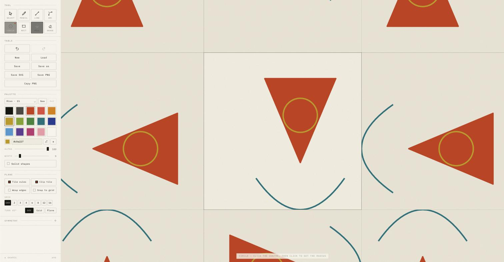

# Tesselate

A drawing table for tessellated patterns. You draw on one tile — a square, a
hexagon or a triangle; the plane around it repeats that tile forever, each copy
given a turn by a symmetry pattern you control. Every mark appears in every
tile as you make it.

Everything is vector: the drawing is a list of paths, curves, circles and filled
regions in tile coordinates, redrawn from those primitives at whatever zoom you
are at. Nothing is stored as pixels, and `Save SVG` writes real geometry.

**[Open the drawing table →](https://invertedworld.github.io/tesselate/)**

## Running it

It runs entirely in the browser: nothing is uploaded, and a drawing in progress
is kept in that browser's own storage until you save it to a file.

Open `index.html` — no build step, no dependencies. To work on it, serve it
with `serve.py`, which sends `Cache-Control: no-store`:

    ./serve.py 8000                 # then visit localhost:8000

That matters: `python3 -m http.server` sends no cache headers at all, so a
browser may go on serving an old `src/app.js` long after you have changed it,
and an edit appears to do nothing.

## Drawing

Shapes can be placed either way, and the two mix freely.

**Click by click:** click to set the first point, move, then click again to
set it. Releasing the first click does not finish the mark — it stays live
and follows the cursor until the second click. Good for long reaches, and for
placing a point precisely, since you can take as long as you like over it.

**Or in one drag:** press, pull the mark out, and let go. The release sets it,
with no second click. A press that slides only a pixel or two is still a
click — most trackpad clicks travel that far — so the mark has to be drawn
right out before letting go counts as finishing it.

`Esc` drops a live mark either way.

| Tool | |
|---|---|
| **Select** `Space` | Click a mark to pick it up, drag to move it. `⌘A` picks up everything on the tile. **Shift-click** adds another to what you are holding, or puts it back down; a **two-finger sweep** takes everything in an area (see below). Outlined shapes can be grabbed by their middle. A click picks a mark up without moving it: nothing moves until the press has travelled as far as a drag. A mark dragged well away comes back towards its square — the plane repeats, so it is the same mark a whole symmetry block over, where every square is turned the way the one it left was and nothing you can see moves |
| **Pencil** `P` | Freehand, tidied when you let go: its wobble is eased out along the stroke and the points that then carry no shape are dropped, with the ends pinned where your hand started and finished. How far is *Smooth*, under the tools: at 0 the stroke is kept exactly as drawn, low settings take out the jitter of the hand, and high ones even out broader wobbles too. The easing is measured along the stroke itself, so it is the same however fast you drew. It belongs to your hand rather than the drawing, so it stays with the table. Hold `Ctrl` (or `Alt`) as you let go and it is kept exactly as drawn instead. Held drag only, and it ignores the grid entirely |
| **Line** `L` | Click each end. It then carries on from where it stopped, so a run of clicks draws a connected chain — `Esc`, or clicking the same point twice, finishes it. A line pulled out in one drag is a single line, not the start of a chain. Hold `Alt` to hold it horizontal, vertical or to 45° — to one of the six isometric ways out on the Iso frame; with a lattice up the length is quantised along that direction too |
| **Arc** `A` | Two clicks for the ends — or one drag — then move to bend it and click to set. An arc owes its bend either way, so the drag sets the chord and hands it on to be bent. Hold `Alt` while bending to keep it symmetrical — the apex is held square above the middle of the chord. The bend may sit outside the tile and the click that sets it can land anywhere |
| **Circle** `C` | Drag rim to rim, or click each end of a diameter — both points you place land on the circle. Hold `Alt` **as you start** to grow it from the centre instead: the first point is then the middle and the second sets the radius |
| **Rect** `R` | Click a corner, then the opposite one; `Alt` for a square. On the **Iso** frame it draws a rhombus instead — a face of a cube |
| **Text** `T` | Click where the letters are to start and type. They appear as you type, repeating across the plane like anything else, with a caret standing where the next letter will go. `Enter` sets them down, `Shift-Enter` takes a new line, `Esc` drops them; clicking into the letters puts the caret at the one you pointed at, and the arrows walk it through them — a letter at a time, a line at a time, a word at a time with `Alt`, to the ends of the line with `⌘` or `Home` and `End` — and typing goes in where it stands, with `Backspace` taking the letter behind it and `Delete` the one in front; clicking again sets what is there and starts afresh where you clicked, so a row of labels is click, type, click. *Size* is the height of the letters against the square — 1000 is the whole of it — and *Face* picks what they are cut from, with *Bold* and *Italic* under it. The ink, the size and the face are read as the text is set down, so a colour or a size chosen part way through belongs to the whole word. What is set down is **outlines, not letters**: the shapes are traced and kept as polygons, so a text mark is a mark like any other — it turns, mirrors, takes a sweep, bends under the warp and exports as paths that need no font at the other end. **Click text already down to open it again** — anywhere in the block the words fill, not on the ink of a letter, since a letter is mostly the paper between its strokes. The words come back with the size, the face and the ink they were set in, the caret where you clicked, and the mark itself is held out of the picture until you are done, so what is on the plane while you type is what you will get. Setting it down again puts the new cut where the old one stood, at the depth it had and in whatever group it was bound into, in one step to undo. Backspace it empty and the mark goes with the words |
| **Fill** `F` | Click an enclosed area — the boundary is traced and stored as a polygon, so it stays sharp at any zoom. On an empty tile there is nothing holding an area in, so the whole square fills, and it comes out as the ground. Click a border and that border takes the current ink. Click inside a figure that is filled already and the whole figure takes it — every fill in it and every border grouped with it — even where its border has since been moved or sized away from it. The first fill of an outlined area leaves the outline its own colour, and an already-filled area can still be cut up by new lines and its parts filled separately |
| **Erase** `E` | Click or drag across a mark to remove it. A border answers before the interior of the mark holding it, and before a fill, so a line drawn across a filled shape can still be got at — and a mark can be rubbed out by any of its ink, including the part that has run over a neighbouring square |
| **Warp** `W` | Click the paper to drop an anchor, and the plane bends round it — see [Warp](#warp). Drag an anchor's dot to move it and the square on its rim to size it; `Delete` removes the anchor in hand. Dragging bare paper pans |

**Face** holds three faces every computer has — *Sans*, *Serif* and *Mono*,
named for what they are rather than for a font, so a drawing made on one
machine is cut from something close on the next. Under them, *Fonts on this
computer* asks the browser for the families it can see and lists them all.
Asking raises a permission of the browser's own, so it is only asked when you
choose that entry, never on opening a drawing; refuse it and the three faces
are still there. Chrome and Edge have the list; other browsers do not offer it
and the entry does not appear. It costs the drawing nothing either way, because
the letters are traced: a face that has since gone off the machine leaves every
mark made with it exactly as it was, and only a re-cut falls back to the plain
sans. *Bold* and *Italic* ask for the heavy and the sloped cut of whichever
face is up — a real italic where the face has one.

Clicking into a word is read the other way round through the same transform
the letters were put through: the point is taken back into the upright letters
the mark was cut from, so a word turned and mirrored is pointed at as though it
never had been, and the caret lands on the letter under the cursor whatever has
been done to it since.

A text mark carries the words it was cut from, so it can be cut again. What
has been done to it since — every move, turn, mirror and sizing — is carried
beside them as a single transform rather than being lost in its points, so a
word turned and mirrored yesterday is still turned and mirrored when a letter
is added to it today, and one made bigger grows from the corner it was started
at. A mark written before text existed carries none of this and is not
editable; nor is anything that was never text.

Directly under the tools is a box named for the tool in hand, holding its
controls and no others: *Snap to grid and geometry* for the tools that snap —
Select, Line, Arc, Circle, Rect and Text; *Thickness* for the tools that draw strokes,
and for Select, which sets it on everything held; *Sweep across*, while there is
a gradient about, for the tools that put ink down and for Select; the group,
turn, depth and clipboard buttons for Select, since they work on what it is
holding; *Filled shapes* for Circle and Rect; *Smooth* for the pencil; *Size*,
*Face*, *Bold* and *Italic* for Text; and the warp's own controls for Warp, with the
anchor held set apart inside it. The
eraser has none, and has no box; nor has the fill, unless it holds a gradient.

The same rule runs down the whole rail: controls that act on one thing are
boxed together and named for it, so nothing reads as belonging to its
neighbour. The colours to pick from are the **Palette**; the colour in hand is
the **Ink**; how thick a stroke is drawn is the tool's. The Palette and the Ink
show only for the tools that put colour down — Pencil, Line, Arc, Circle, Rect,
Text and Fill — and are put away for Select, Erase and Warp. The keys work whichever
tool is up — `S` still switches snapping from the pencil, and a number key still
recolours what Select is holding.

Straight geometry is stroked with **flat ends**, so a line stops exactly on
the point it was placed on and runs flush to the tile edge to meet its own
reflection; rectangle corners mitre. Freehand keeps round ends.

Where two ends **meet**, though, the corner is rounded off — flat caps meeting
at an angle leave a notch on the outside of the join. Ends that stop in space
stay flat, so precision is kept where it matters and corners still look like
corners.

Ends meet **across the seam** as well as within a square: a mark running past
its own edge can join another square's copy end to end, and that corner is
rounded too. Which ends meet there depends only on where a square sits in the
block, so it is worked out once per block position and kept until the marks
change. (`Save SVG` writes one definition reused for every square, so it can
only carry the joins that happen within one — the ones made by the tiling are
not in it.)

### Fills and groups

Filling an area does one of two things:

- If the area is exactly the inside of one closed mark, it becomes that mark's
  own interior — one object, whose border alone takes the ink when the fill
  tool clicks the border, and which takes it whole when clicked inside. It is
  still a fill, and is painted at fill depth: an area filled *inside* that mark
  goes on top of it, not under.
- If it was bounded by several marks — a triangle drawn as three lines, say —
  the fill is **grouped** with them. Picking up any member moves the whole
  group, and `Delete` removes it.

### Picking things up

Click a mark to hold it; **Shift-click** to add another, or to put one back
down. Holding any member of a group holds the whole group — what is outlined is
what will move.

**Sweeping an area.** Press on empty paper and drag: a box follows the
pointer, the count of what is inside follows with it, and everything **wholly
inside** is held on release. Wholly, not merely touched, so sweeping over a
figure does not drag in the ground it sits on. Shift-drag keeps what you were
already holding and adds to it; `Esc` part-way through drops the sweep and puts
back what was in hand.

A sweep belongs to the square it was started in, and the box **stops at that
square's edge**: take the pointer past it and the box holds at the perimeter
rather than following into a neighbour it could not pick anything up from.

Because a drag now sweeps, the plane is panned with the select tool up by
two-finger scrolling or a middle/right-drag rather than by dragging the paper.
Pinch still zooms.

The four buttons under the tools all work on the whole of what you are holding,
about the centre of what it makes together — so a figure of several marks keeps
its shape instead of each mark moving on its own spot. **Turn** takes it 45°
either way; an upright box cannot hold a turn, so it becomes the four-cornered
polygon the turn has just made of it and carries on behaving like one. **Flip**
mirrors it left to right or top to bottom, and a box mirrors to a box, so unlike
a turn it stays one. They carry no caption: four glyphs read faster in a row
than four labels, and the words are in the tooltips.

The row under them sets **depth**: to the bottom, down one, up one, to the top.
What they stack is what the plane paints as one thing — a group, a fill and
the borders it holds — so a figure goes up or down whole, and one step passes
one other thing however many marks that thing is made of. Depth is the order
of the whole tile rather than of whatever happens to overlap, so a step can
pass a mark nowhere near and change nothing you can see. Fills in no group are
the ground and keep a stack of their own: they reorder among themselves and
never come up through a mark. Each pair goes quiet once there is nothing left
to pass that way. Moving, turning and flipping still bring what they touch to
the top, so set the depth last.

**Cut** `⌘X`, **Copy** `⌘C` and **Paste** `⌘V` work on what you are holding.
The marks go on the **real clipboard**, written as the same JSON a drawing is
saved as, so a figure can be carried to another tile, another tab, another day —
or pasted into a text editor and read. Everything comes back with fresh ids: a
pasted group stays a group without joining a group already on the tile, and a
pasted fill goes on naming the borders it arrived with. Each paste steps a
little further from the last so they do not stack, and lands held by the select
tool, ready to be dragged into place.

**Duplicate** `⌘D` is a copy and a paste in one, without the clipboard: a copy
of what you are holding lands a little to the right of it and below, and is
held in its place, while whatever you copied last is still there to paste.
Right and below as you see them — in a turned square, on the 45° plane and
through a warp alike — and only a few pixels, so the copy is never lost from
sight. Press it again and the copy is copied, a little further on.

The keys are taken by the table itself rather than left to the browser, which
in some browsers raises no copy or paste at all while nothing on the page is
selected. A paste still comes through the browser where it can, since that
hands over the clipboard without asking; where it cannot, the clipboard is asked
for outright, and failing that the last copy made in the table is pasted. With
snapping on, a paste steps a cell of the lattice — or the
ordinary step while the grid is off.

**Group** `G` binds what you are holding into one thing that moves, recolours
and goes as a unit; **Ungroup** `U` lets it loose. A fill made against
several marks is grouped with them already — this is the same binding, by hand.
The two buttons under the tools say when they apply: Group wants two separate
things in hand, Ungroup wants something bound.

**Groups nest.** Group a group with something else and it goes inside the new
group whole rather than melting into it; Ungroup takes off one level and leaves
whatever was inside as it was. A click holds the outermost group, and a **click
again** on something held goes one group further in: to the group inside that
the pointer is over, and at last to the mark itself. Gone inside a group, a
click on another member of it holds that member rather than the whole group
over again; a click on anything outside it starts from the top. A drag always
moves what is held, so it is a click, not a press, that goes further in.

Whatever is held, however far in, is what the number keys recolour — every mark
of it — what the arrows nudge and what `Delete` removes. Grouping things held
inside a group makes the new group inside that one, and a duplicate made there
stays there.

### Grips

What you are holding gets a grip on each corner of its box. Drag one and the
whole lot **sizes** about the corner opposite, so the one you are not holding
stays where it is. It is one factor, not two — an ellipse is not a shape this
can hold, so a circle has to come out a circle — read off whichever way the box
has more room, and a stroke keeps the width it was given: how heavy a line is
was a choice about the mark, not about how big it is drawn.

Move the pointer a little **past** a corner and a turn ring appears there
instead. Dragging it turns everything held about the middle of what it makes
together, in **eighths of a turn** while snapping is on, any angle at all while
it is off — and `Shift` flips whichever of those you are in. It only
shows while the pointer is out there, so the box stays quiet the rest of the
time.

Hold a **single** line, arc or circle and it also gets grips on its own points:
either end of a line, either end of an arc and its bend, and four on a circle's
rim for the radius. The bend grip sits on the arc itself rather than on the
control point, which is off the curve entirely and means nothing to the eye.
Grips take the lattice like anything else drawn, so `Snap to grid and geometry`
pulls them onto it.

A single **pencil stroke** gets grips all along its length, spaced out on
screen so they can be told apart, with one on each end. Each sits on the stroke
itself, and dragging it bends the stroke through the pointer: the pull is whole
at the grip and eases off to nothing at the grips either side. So a stroke kept
exactly as drawn, with a point every pixel or two, still bends as a curve
rather than pulling out a spike. These ignore the lattice, as the pencil always
has.

### With something in hand

What is in hand is haloed: **one ring round the lot**, the same colour and the
same reach all the way round, lying on the paper just outside the ink. It is
the ink in hand grown a few pixels and cut out again by that same ink, so it
never covers the marks it belongs to, and it goes over the rest of the drawing,
so nothing hides it either. It is vermilion — or dark where any of the ink in
hand is vermilion itself, decided for the whole of what is held rather than
mark by mark. Laid down under the marks with a glow to each, a figure came out
glowing two colours at once, further out from its border than from its fill,
and dimmed wherever other ink crossed it.

The palette recolours it, arrow keys nudge it (`Alt` for a bigger step,
one lattice cell at a time when snapping is on), `Delete` removes it and
`Esc` lets it go — all of which act on the whole group if it is in one. Moving
a mark moves every copy of it, since there is only ever one shape — the plane
just repeats it. Whatever you move comes to the top, so it sits above what you
moved it onto.

**Any square is the drawing surface.** Whichever one the pointer is over is
the one you are drawing in, and it holds still while you place a mark. Nothing
is lit up to say so: the lattice is ruled across the whole plane instead, every
square the same, so there is no highlight following the mouse to watch. There
is still only one set of marks — a point is mapped back through that square's
own placement and quarter-turn, so drawing in a turned tile puts the mark
exactly where you drew it and the pattern follows.

Marks may start on the tile edge and run past it — that is how a motif is made
to carry across the seam.

*Filled shapes* fills circles and rectangles instead of outlining them. It sits
under the tools while Circle or Rect is in hand.

**Recently used** is a strip of ten smaller slots under the palette. Ink lands
there when it is used on the drawing — a mark drawn in it, an area filled with
it, a mark recoloured to it — newest first, one of each, and the eleventh pushes
the oldest out. Mixing alone records nothing: a hex typed, a colour dimmed, a
gradient set up or a colour taken with the eyedropper waits until it has been
put down on something, and undoing or opening a drawing is not using the ink it
brings back. A colour already in the palette in hand is not recorded, since it
is a click away as it is. It is written down a moment after the drawing settles,
and only if it is still on a mark by then: a drag of the alpha across something
held passes through forty colours on its way to the one that was wanted, and
none of the forty is worth a slot. The empty slots are drawn, so the strip keeps its
shape as it fills. It belongs to the table rather than to any one drawing, so
it survives opening another, and *+* still adds to the palette proper.

**Drag a colour from either strip to the other** and it lands there as a copy —
the one you dragged stays where it was. Out of the recent slots into the
palette is how a mixed colour is kept; out of the palette into the slots is how
one is put within reach without being on the palette.

A slot has a **×** on hover, the same as a palette swatch. The strip keeps
itself — the eleventh colour pushes the oldest off the end — so that was not
needed while everything in it arrived by being used; something dragged in on
purpose should be removable on purpose rather than waiting for ten newer
colours to shift it.

It goes **where you drop it**, not on the end: a bar shows the place it would
take, in front of the swatch nearest the pointer or behind it once you are past
its middle. Dragging **within** a strip reorders it, since a colour already
there is moved rather than doubled. Dropping over the empty tail of the recent
slots puts it at the end of what is actually in them.

### Gradients

*Gradient* turns the ink into a fade from one colour to another. It applies to
anything that takes ink — a fill, a solid shape, or a stroke along its length.
Switching it on the first time runs from the ink you have, at full strength, to
its **complement**, also at full strength — the colour across the painter's wheel
from it, red to green, blue to orange, yellow to violet, as light and as strong
as it is; or for a grey, which has no complement, the grey across from it, black
to white — so there is a sweep to see at once. Switching it off keeps the
colour it started from. After that it remembers the sweep, and switching it back
on returns the angle and the colour it faded to. The angle is degrees clockwise
from east.

A **swatch** is the ink it shows, whole — clicked in the palette or the recent
strip, or chosen with a number key. A plain colour puts the gradient away and a
gradient brings it out, and the switch follows either way; the sweep put away is
remembered, so switching back on returns it.

What a sweep is measured over is not the gradient's but the stroke's or the
fill's that wears it, so one gradient from the palette can lie across a mark in
one place and across the tile in another. *Sweep across*, in the tool box, sets
it — for the marks to come and, with something held, for every gradient held —
and both choices repeat exactly:

- **Mark** — each mark's own bounds, so every copy of it looks the same
  wherever it lands on the plane.
- **Tile** — the square, so a whole figure fades together across it.

A stroke and a fill on the same mark each keep their own. The fill tool paints
with the ink in hand and the way it lies; recolouring what Select holds from the
ink keeps the way each held sweep already lay; and the eyedropper takes a sweep
off a mark together with the way it lay there.

There is deliberately no sweep across the plane: the plane is infinite, so
there is nothing for the stops to run between, and a drawing painted that way
would stop being a tiling.

A gradient is written as text, so it saves, keys a palette and goes on a swatch
exactly the way a flat colour does — nothing else in the app has to know about
a second kind of value:

    lin(45,#cf4326,#2b4a9c)

Ink written before carried what it ran across as a field of its own —
`lin(45,tile,…)` — and still opens: the field moves onto the mark wearing it.

The switch heads the **Ink** panel, and with the gradient on the ink's
controls become the gradient's own, in three boxes. **Sweep** is the gradient as
a whole: a button that swaps the two ends and the **+** that keeps it in the
palette, at its head, then the angle.

The angle is set on a **dial**: a square of the sweep as it will fall across a
mark, with a hand pointing the way it runs, so the effect is seen as it is set.
Drag anywhere on it to point the sweep there — five degrees at a time, or to the
nearest 45° with `Alt`, as a line is held to 45° — or step it with the arrow keys
once it has focus (`Shift` for 45°), or type the degrees beside it. A drag is one
step to undo. **From** and **To** are its ends, each with everything that
belongs to it — its well, which is its colour picker, its hex, an eyedropper of
its own, and its alpha.

To mix a sweep from the palette, **drag** a plain swatch from either strip onto
From or To: the box shows a dashed outline while a drop there would fill it. An
end's eyedropper takes its colour off the drawing, and a swap trades the two
ends.

Either end may fade all the way to nothing — a fade that stopped just short
would leave a visible edge where it ended — but not both at once, which would
be ink no one could find again.

Exported SVG carries a `<linearGradient>` def per sweep, in the tile's own
coordinates, so one def serves every copy the sheet instances.

Ink `1`–`9`,`0` (the first ten of the palette in hand) · weight `[` `]` ·
undo/redo `⌘Z` / `⇧⌘Z` · cut/copy/paste `⌘X` `⌘C` `⌘V` · duplicate `⌘D` ·
select all `⌘A` · group `G` / ungroup `U` (or `⌘G` / `⇧⌘G`) · eyedropper `I` ·
recentre `H` ·
show tiles `X` · snapping `S` · grid size `D`

`Shift` suspends snapping, or asks for it while it is off · `Alt` (or `Ctrl`)
constrains what a tool is drawing

While a caret is down, every key is a letter: the tool keys, the ink keys and
the rest stand aside until the text is set down or dropped. The arrows move the
caret rather than nudging what is held, and `⌘←` and `⌘→` go to the ends of
the line rather than being dropped with the other unclaimed shortcuts. The
shortcuts that take a modifier — undo, save, select all — still answer, so
nothing is out of reach mid-word.

### Off the table

Everything the table itself does is a toolbar at the top of the rail: undo and
redo, then the file — new, open, save, save as — then what comes off it: SVG,
PNG, and PNG to the clipboard. Icons only, with the words in the tooltips, so
the whole of it fits one row and the panels below can get on with the drawing.
A little air marks off the three groups. Where there is no file picker the
*Save as* button is not shown and the words change to *Download*, but the
glyphs stay where they are.

| | |
|---|---|
| **New** | A clean tile: it lets go of whatever file the drawing came from and drops the undo history with it. With marks on the table it asks *Do you want to save your changes?* first — in the rail, not in a browser box. **Yes** saves and then starts over, and backing out of the file picker leaves everything as it was; **No** starts over anyway; **Cancel** or `Esc` goes back |
| **Load** `⌘O` / **Save** `⌘S` / **Save as** `⇧⌘S` | The drawing as a `.json` file — see below |
| **Save SVG** | The pattern as vector paths, several whole blocks of it, with the rules and the lattice left off |
| **Save PNG** | The same frame you are looking at, marks only, on a clear ground |
| **Copy PNG** | That same image straight onto the clipboard, to paste anywhere |

## The drawing as a file

A saved `.json` holds the drawing and the bench it was made at: the marks, the
symmetry block they repeat under, the grid it was drawn to, the ink in hand,
and the colours mixed for it — which are no use to it sitting in another
table's storage. Open it anywhere and it comes back set up the way it was left.

What is *not* written is what belongs to the moment rather than to the picture:
which tool is in hand, where the view is scrolled, how far it is zoomed.

Everything is checked on the way back in, and anything a file does not carry is
left as the table already has it, so drawings saved before this still open.

It is meant to be read. One mark per line, so a drawing diffs like source:

    {
     "format": "tesselate",
     "version": 1,
     "saved": "2026-09-11T07:01:13.385Z",
     "tile": 1000,
     "pattern": {"shape":"square","n":2,"cells":[0,1,3,2]},
     "plane": {"grid":true,"snap":false,"sub":8,"subLast":8,"diag":"off",
               "warp":{"amount":1,"repeat":"plane","ink":"swell","anchors":[{"x":500,"y":500,"r":400,"bulge":0.5,"twirl":0}]}},
     "ink": {"color":"#cf4326","across":"shape","width":9,"filled":false},
     "palette": {"name":"Riso · 15","palettes":[…],"recent":[…]},
     "shapes": [
      {"id":1,"layer":"stroke","kind":"line","color":"#cf4326","width":9,"pts":[…]},
      {"id":2,"layer":"fill","color":"#2b4a9c40","loops":[[…]]}
     ]
    }

Coordinates are in tile units — the tile is `tile` across, 1000 — so a drawing
is resolution-free and stays exact at any zoom. `pattern.shape` is the tile the
marks were drawn to, `square`, `hex` or `tri`; a file saved before there were
shapes has none and opens as squares. A mark in a group carries
`group`, the outermost group it is in; one inside a group within a group also
carries `groups`, the whole chain, outermost first. A stroke or fill in a
gradient that lies across the tile says so with `"across":"tile"` beside its
`color`, or `"fillAcross":"tile"` beside its `fillColor`; without it the sweep
lies across the mark.

Where the browser has the File System Access API (**Chrome and Edge only** —
Safari and Firefox have none), the file you opened or saved is **kept**: *Save* writes straight back to it without asking
again, and the handle is stashed in IndexedDB so it survives a reload — the
first save after coming back may ask once for permission, then goes quiet.
*Save as* always asks for a new place.

**Elsewhere there is no picker at all**, so nothing can be written back over
and the buttons stop pretending otherwise: *Save* reads **Download** on those
browsers, and the exports beside it read Download SVG and Download PNG, because
that is where all three end up. *Save as* goes altogether: with nowhere to
write back to, every download is already a new file, so it would only do what
Download does. Download keeps offering the name it last used, which is as near
as a download gets to writing back over something. *Load* opens the ordinary
file chooser. The file in play is named under the buttons, with a
vermilion dot while the drawing has moved on since it was written.

**New** puts the table back to how it starts: an empty tile of the shape in
use, that shape's first symmetry block, the default grid, ink and view. Anything a drawing carries is a
setting *of* that drawing and goes with it — but your palettes and the recently
mixed strip belong to the table rather than to any one picture, and stay put.

Opening a drawing, or starting one, is a new session rather than an edit, so
the **undo history goes** with it: the steps behind it belong to a picture that
is no longer on the table. Save before you load if the marks matter.

Pan by two-finger scrolling or middle/right-dragging. With every tool but
select, dragging empty space pans too — under the select tool that drag sweeps
out an area instead.

## Palette

Three palettes come with the table — **Riso**, **Bauhaus** and **Graphite**,
fifteen colours each — and you can keep as many of your own as you like.

The colour in hand is the **Ink** panel, under the palette: its well — click it
and the system colour picker opens on that colour — a **hex field** that takes
any of `#rrggbb`, `#rgb`, `#rrggbbaa` or `#rgba`, with or without the `#`; and an
**eyedropper** `I` — arm it and the next click anywhere on the plane takes the
colour under the pointer, `Esc` to put it down.

It asks the **mark**, and the canvas only where there is no mark. A stroke two
units wide is half soft edge, and a pixel read off that edge is the mark's
colour mixed with whatever is behind it, never the colour the mark is drawn in.
Click a border and you get the border's colour, the inside of a closed mark and
you get its interior's, a filled area and you get the fill's; click bare paper
and it reads the canvas rather than the screen. **Alpha** sets how far through
the ink you can see, down to 1% — it stops there rather than at nothing, since
ink you cannot see at all is a mark you can no longer find on the plane. A
colour keeps its short form while it is solid and gains the extra two digits
the moment it is not, so the swatch and the field always agree. Translucent ink
is real ink: it fills, strokes, exports and layers like any other, and every
well is drawn over a check so you can see what is left of the paper.

**+** puts the colour in hand into the palette. The three built-ins are as
printed, so adding to one takes a copy first — *My Riso*, say — and adds it
there. **New** names a palette of your own and starts it **empty**: it is
somewhere to put colours rather than another copy of the ones already to hand,
and *+* and the recently used strip are where they come from. A swatch in one
of yours has a **×** on hover, and a palette of yours may be emptied right out,
since it can be made that way. The **pencil** renames one of yours — the
built-ins keep their names — and **Del** asks once, then removes the palette.
Your palettes are kept with the drawing.

## The alignment grid

*Show grid* lays an *n × n* lattice over the square you are working in. Tick it
to turn the lattice on; the sizes below it — 2, 3, 4, 6, 8, 12, 16, 32 or 64, cycled
with `D` — are its own and go quiet while it is off. Switching it off keeps the
size you were working to, so switching back on returns that rather than a
default. It is a drafting aid and is independent of snapping: you can have the
lattice without it pulling on anything.

It is ruled in **dots**, where the tile rules are solid. Drawn solid the two
differed by a shade, and at most zooms a cell of the lattice read as a square
of the plane — a mark sitting in one cell of four looked as though it had gone
missing from three squares in four.

What you set is what you see at the fitted zoom. **Every doubling of the zoom
halves the cells again**, drawn fainter than the lattice you asked for, so
closing in gives you finer places to put things — up to five levels, and never
finer than the screen can show. Each level contains the one above it, so a mark
placed close in still lines up with one placed far out.

### Grid type

Three grids to draft on:

- **Square** — the plain lattice, everything upright.
- **Iso** — a triangular lattice: upright lines, and two families thirty
  degrees either side of level. Every step out of a lattice point is **near
  enough the same length whichever of the six ways it goes** — the six differ
  by under 3% from six columns up, and under 1% at 8, 16, 32 and 64 — which is
  the thing a square lattice cannot do at all: a step along its diagonal is √2
  of a step along its side, turned or not. So a box drawn on it has edges that are actually
  equal, and reads as a solid rather than as a drawing of one.

  On this frame the rectangle tool draws a rhombus instead: the drag falls in
  one of the six wedges and the two directions around it become its sides, so
  every box you pull out is a face of a cube — three drags make one. `Alt`
  makes the sides equal. `Alt` on a line or an arc holds it to one of the six
  ways out, a whole number of steps along.

  The lattice is ruled over every square, and **turned with each of them**: a
  quarter-turn carries a square lattice onto itself but not a triangular one,
  and what is drawn has to be what a mark placed there would line up with. It
  is dropped when the squares get too small or too many for it to help.

  The upright lines are the tile's own columns, so they land on its edges, and
  **the rows are laid a whole number to the tile as well**, so the lattice meets
  itself across a seam. That is what costs the triangle its last few per cent:
  exactly equilateral would put 0.866·n rows in the tile, which is never a whole
  number, so the count is rounded to the nearest one. The columns are taken up
  to an even number for the same reason — the thirty degree lines climb half a
  row per column, so they only come back to a row after an even number of them.
  Repeating is worth more than the last per cent of equilateral on a plane whose
  whole subject is repetition; at 2, 3 and 4 columns the rounding is coarse
  enough to see, around a sixth.

  Across a **turned** square it still cannot match: a quarter-turn carries a
  square lattice onto itself but not a triangular one. Where the block turns a
  square the lattice turns with it, because what is drawn has to be what a mark
  placed there would line up with.
- **45°** — the whole plane turns instead: tiles, rules, lattice and every mark
  together, so a tile-aligned square reads as a diamond on screen. Drawing
  works unchanged; the pointer is mapped back through the angle.

**A slider with something in hand works on what is held.** *Thickness* sets every
stroke held, and *Sweep across* every gradient held. A run of the slider is a
single step to undo, not one per pixel of travel. The palette and the ink are
put away while Select is up, so held marks are recoloured with the number keys,
or with the fill tool, which recolours whatever it is clicked on.

*Snap to grid and geometry* (`S`), under the tools, pulls new geometry onto the
lattice **and onto the marks already on the tile** — the ends and middles of
lines and arcs, the centres and rims of circles, the corners of rectangles. A
mark within reach of the cursor wins over the lattice, and snapping keeps
working with the grid switched off.

### The two modifiers

Each has one job, everywhere.

**Shift is snapping.** It suspends it where it is on, and asks for it where it
is off — one key for *not this time* and *just this once* both. Everything that
snaps follows it: the lattice, the marks already drawn, the coarse step a
circle falls back on when there is no lattice, and the eighths of a turn the
rotation grip steps in. The mark under the cursor is worked out again the
moment the key moves, so you can see what you would get before pressing.

**Alt — or Control — constrains.** Everything a tool can be asked to hold to
while it is being drawn:

| | |
|---|---|
| Line, arc | Horizontal, vertical or 45° — one of the six isometric ways out on the Iso frame |
| Arc bend | The apex square above the middle of the chord, so the arc is symmetrical |
| Rect | Squared off on the longer side |
| Rect on **Iso** | Equal sides: the cube face itself rather than a panel of one |
| Circle | Grown from its centre rather than rim to rim — read at the press, so letting go midway will not switch it |
| Pencil | Kept exactly as drawn, with nothing dropped and nothing eased — read as you let go, so it can be decided once the stroke is down |
| Arrow keys | Five steps at a time instead of one |

`Shift`-click still adds a mark to what you are holding, as does `⌘`-click.
That is the ordinary way to build a selection and it does not collide with
either job above, since nothing is being snapped while you pick things up.

A red cross marks the point that has been caught. Targets are ranked rather
than just measured: where several marks meet, their midpoints and rims crowd
the junction and would win on distance alone, so a point a mark *ends* at beats
one it merely passes through. What it pulls:

- line and curve endpoints, and the point an arc is bent through
- both corners of a rectangle
- circle centres, with the radius stepping half a cell at a time
- the two ends of a freehand stroke
- **anywhere along any mark** — its line, its arc, its rim, its side — ranked
  last, so an end still wins wherever one is in reach
- a mark being dragged with the select tool, by its own anchor — so a snapped
  mark stays snapped and a stray one is pulled into line

That last one is what makes the rest of it hold up with **the lattice off**.
Named points alone left a click away from an end or a middle with nothing to
catch on, so it fell through to the lattice: with the lattice off nothing
happened, and with it on what looked like snapping to a mark was really
snapping to a grid point that happened to lie under it.

Freehand ignores the lattice when drawing: the pencil never touches it.

Snapping the ends to the tile edge is what makes a motif meet its own
reflection cleanly across the seam, and it closes shapes reliably enough for
the fill tool to find them. Hold `Shift` to suspend the lattice for one mark,
or to ask for it while snapping is off.
`Alt` takes precedence over snapping: asking for a direction is the more
specific request, and the length is then quantised along it so the far end
still lands on the lattice.

The two are independent: turning *Show grid* off leaves snapping on
and working — it just falls back to the marks themselves.

## Symmetry

**Tile** picks the shape drawn on:

- **Square** — the plain grid; each copy turns by quarters.
- **Hex** — flat-topped hexagons, three meeting at every corner; each copy
  turns by sixths.
- **Triangle** — equilateral triangles, six meeting at every corner, pointing
  up and down by turns. A down triangle is the up one turned a sixth about its
  own middle, so each copy turns by thirds on top of what its place asks for.

Every tile fits the same 1000-unit square and turns about its own middle, so
the tools, the lattice and the file are the same whatever the shape. The marks
are drawn to the tile they were drawn on, though, and mean nothing on another:
**choosing another shape starts a new drawing**. If what is on the table is
not safely in a file — never saved, or changed since — the panel asks first
whether to save it, the way **New** does: *Yes* saves and then starts over,
*No* starts over anyway, *Cancel* or `Esc` goes back. An empty table just
changes.

Rotation is defined by a block of turns tiled across the plane: *n × n* for the
square and the hexagon, and *2n × n* for the triangle, so the block holds
whole up-and-down pairs. Pick a preset, choose a block size — 1–4, or 1–3 for
the triangle — then click any cell to turn it one step. The cell with the
upright arrow is your drawing surface and stays upright, so presets are stored
relative to it.

Square:

- **Translate** — no rotation, plain repetition
- **Pinwheel** — the 2×2 four-fold rotation
- **Rows** / **Columns** / **Checker** — half-turns in one direction or alternating
- **Triple**, **Cascade**, **Windmill**, **Spin** — diagonal and 4×4 rotations

Hex:

- **Translate** — no rotation
- **Rows** / **Columns** — half-turns along one direction of the lattice
- **Trio** — the three hexagons round one corner in three are spun about it,
  so every hexagon belongs to one three-fold figure
- **Cascade**, **Spin** — thirds and sixths stepping across the block

Triangle:

- **Alternate** — every up triangle alike, every down one the same turned a sixth
- **Half-turn** — the down triangles turned a half instead, so each pair is a
  rhombus with a centre of symmetry
- **Rosette** — the six triangles round one corner in three are spun about
  it, so the plane is covered in six-fold rosettes
- **Rows**, **Cascade** — thirds stepping down and across the block

Changing the block is an edit of the drawing like any other. A preset, a new
size and a turned square each go on the undo stack, so a smaller block is not
the one-way door it looks: it drops the squares outside it, and `⌘Z` brings
them back with their turns.

**Show orientation** puts a small arrow in each tile on the plane, pointing
the way that square has been turned. A drawing under a block of quarter-turns
reads as one figure, and it is easy to lose track of which square is which; the
block above says it for the pattern, this says it on the work itself.

The badge sits at the top left of each square **as drawn** and stays there: one
carried round by the turn would land on a different corner every quarter,
telling you the same thing twice and being harder to find for it. The arrow
inside it does the turning. It is vermilion and heavy, because it is an answer
to a question you are asking rather than part of the work — and it goes when
the squares are too small to hold it, on the same reasoning as the lattice:
too small to read is worse than absent, because it becomes noise along the
rules. On the hexagon and the triangle it sits further in from that corner,
clear of the other tiles' arrows at the same corner.

## Plane

- **Show tiles** — the tile grid drawn across the plane, with the symmetry
  block's boundaries heavier again. They read darker and thicker than the
  alignment lattice inside them, so the structure sits over the drafting aid
  rather than under it; where the squares are packed too close to carry a
  wider line they drop back to a hairline. Display only
- **Show grid** and its sizes — the alignment lattice, above. *Snap to grid and
  geometry* sits with the tools rather than here, since it changes how they draw

A mark that runs past the seam bleeds over its neighbours and overlaps them,
which is what you want while drawing: the plane is one drawing, not a sheet of
separate squares. So it is painted mark by mark across every square rather than
square by square, and depth means the same thing everywhere — finishing one
square before starting the next would put everything the next square draws over
everything this one drew, and a fill two squares along would land on a border
already laid down.

Pinch the trackpad to zoom; two-finger scroll or middle-drag to pan.
Work is kept in `localStorage`, so the table is as you left it.

*Save SVG* and *Save PNG* write the marks and nothing else — no grid, no crop
marks, no paper — on a clear ground. The SVG is a single `<g>` of vector paths
instanced once per tile with a rotation, over a block-aligned sheet of at least
4×4 tiles.

## Warp

The **Warp** tool `W` bends the plane. Click the paper to drop an anchor: the
paper round it swells, and every straight line near it — the marks, the tile
rules, the lattice — comes out as a curve. Drag an anchor's dot to move it and
the square on its rim to size it; `Delete` removes the anchor in hand and `Esc`
lets it go. The anchors only show while the tool is up.

It is a way of looking at the drawing, not a change to it. The marks stay
exactly as they were drawn, and the pointer is taken back through the warp on
its way in — the way the 45° frame takes it back through the angle — so
everything else works through it unchanged. A line drawn in a bulge lands where
the pointer put it, snapping catches the bent lattice, a click picks up the
mark it lands on, and the fill tool floods the area under the pointer.

Its controls sit directly under the tools while Warp is in hand:

| | |
|---|---|
| **Amount** | The whole warp, faded in and out. At 0 the plane is flat, and the anchors are kept for when it comes back up |
| **Anchors: Plane** | Each anchor sits once, where it was put — a lens laid over the pattern. Inside it the pattern stops repeating exactly |
| **Anchors: Tile** | Each anchor sits in every square, carried round by that square's quarter-turn, so the warp repeats exactly as the drawing does and it is still a tiling. An anchor whose disc stays inside its square leaves the seams straight; one sitting on a seam bends the tile edges themselves, and the bent tiles still fit each other |
| **Ink: Bends** | A stroke follows the warp at the width it was given |
| **Ink: Swells** | A stroke is warped as the area it covers, so a bulge thickens the ink along with the paper under it |
| **Bulge** | For the anchor in hand: how far it swells the middle of its disc, up to about four and a half times. Below 0 it pinches instead |
| **Twirl** | How far it turns the middle of its disc, up to a full turn either way |
| **Radius** | How big its disc is. Nothing outside the disc moves |

Swells is what keeps a fill against its border. A fill is tucked just under
the edge of the stroke around it; under Bends, where a bulge magnifies the paper
the fill's edge moves out and the stroke does not, and a hairline of bare paper
opens between them. Bends is the lighter of the two to draw.

The rules and the lattice bend with the marks. They are lines on the same
paper, and ruled straight over bent marks they would stop saying where a seam
is.

**Anchors can overlap.** The warp is a flow: each anchor pushes the paper out
from its middle and round it, fading to nothing at its rim, and every point is
carried along all of them at once. A flow cannot fold, however strong or
crowded the anchors, so two points of the drawing never land on one and the
pointer always has exactly one place to go back to. Dropped or dragged inside
another anchor's disc, a dot is aimed so it still lands under the pointer —
taken straight back, the other anchor would carry it off.

**Undo** takes anchors back as it takes back marks. Dropping, moving, sizing and
removing one are each a step; a run of a slider is a single step, and so is a
switch of Plane, Tile or ink.

The warp is **part of the drawing**. It is saved with it under `plane.warp`, a
drawing saved before there was a warp opens flat, and *New* clears it.

So it goes out with the drawing. *Save PNG* and *Copy PNG* are the frame as it
stands. *Save SVG* writes the warped geometry: with Tile anchors, one warped
definition for each square of the block, and every square on the sheet pointing
at its own; with Plane anchors, the squares the lens reaches written out in full
and every other square the plain tile, as before. Swelled strokes are written as
filled paths. A gradient keeps its sweep straight across a warped mark.

A warped copy of a mark is built once and kept — per square, or per square of
the block where anchors repeat, and per step of zoom — so panning costs nothing
extra; moving an anchor rebuilds what it reaches. `lab/warp.html` is the bench
the warp was worked out on, with the ideas tried along the way.

## The room

Dark grey bench, white paper, one vermilion accent. The rail is meant to
recede: all the colour is in the artwork and none in the room around it, so
nothing in the tools competes with what is being drawn. The paper is white
rather than tinted, so a colour on screen is the colour it is.

## Layout

    index.html        markup and the control rail
    styles.css        all styling
    src/geometry.js   path building, SVG path data, simplification,
                      flood fill to vector contour tracing
    src/patterns.js   the tilings — where each copy of the tile sits and how
                      it is turned — and their symmetry presets
    src/warp.js       the warp: anchors as a flow, and marks laid through it
    src/app.js        state, renderer, input, UI, export

### How fill stays vector

The fill rasterises the marks into a scratch grid only to work out *which*
enclosed area was clicked. It floods from the cursor (eight-connected, since
the gap where two marks converge is a diagonal channel), bridges the cell or
two the grid loses where that gap pinches shut, walks the boundary into closed
loops and simplifies them.

What goes into the grid is **everything the eye can see holding that area in**,
not just the square's own marks. A mark runs over its neighbours, so the
squares around this one lay ink on it as well; each is drawn
through its own quarter-turn and mapped back into this square's frame. Without
that, an area enclosed by a neighbour's ink flooded straight out, because the
flood had never been told about it.

That has to reach past the edge of **the grid**, not the edge of the square.
When the grid widens, the squares beyond the widened ring still run ink into
it, and leaving them out left the barrier full of holes exactly where the flood
was about to be judged on whether it had escaped.

**How wide the grid is laid** answers the other half of that. An area held in
partly by a neighbour's ink runs past the square's edge, and a fill that
stopped there left a bite out of the shape — so when the flood reaches the edge
of its grid, the grid is laid again over the square and the ring around it and
the flood run afresh. Most fills never touch the edge and pay nothing for it.
Two cases are not areas that continue, and stay on the square: one meeting
**all four** edges is the ground the marks sit on, and one still running at the
wider grid was never enclosed at all — a mark the size of the square tiles,
where one the size of three does not.

All four edges only reads as the ground **on the square's own grid**. On the
widened one it says the flood ran out to every edge of nine squares, which is
the opposite of enclosed. Read as the ground there, that blob was kept: a fill
clicked in a corner came back two and a half squares across, and its copies
tiled over everything around them.

An area that is cropped back to the square **comes round the other side**. It
ran off the edge into the next square, and the next square is this same tile
again, so the point just past the edge is a point of this tile — read in the
neighbour's own frame, quarter turn and all — and the flood goes on from there.
A band straddling a seam is one click, not two: without it only the half on
this side filled, and it looked as though the fill had stopped at nothing.
Nothing is crossed that was not already open, since the flood beyond the seam
runs on the same barrier as the flood before it.

How far it may bridge is set by the **thinnest mark in play**. The bridge eats
into a wall from the inside, and a wall it eats through is no wall: an outline
five units across used to let the fill straight out into the rest of the tile.
A mark only two cells across on the scratch grid can spare none, so a hairline
outline gets no bridging at all — a fill that stops a hair short of a pinch
being a great deal better than one that escapes the shape.

A grid can only place an edge to the nearest cell, which leaves a fill either
short of the mark bounding it or spilling past it — and no amount of tuning the
grid fixes both at once. So the traced ring is used for its **topology** only.
Each of its points is then moved onto the **true** edge of whichever mark it is
closest to: half that mark's width out from its centreline, less a hair so it
tucks under rather than meeting exactly. The marks are exact, so the fill's
edge becomes exact too.

How far back the snap may reach has to cover how far out the grown mask went.
The flood is grown twice — once to bridge a pinch, once to tuck under the ink —
so the traced ring can stand a good two grows inside a wall, plus the cell it
was placed to. Asked to reach back only a cell or two, the snap could not see
the wall it had gone past and left the point where it lay: the fill sat seven
units inside a stroke nine and a half wide, and the stroke read as thin along
everything filled against it.

Points are not enough on a **round** wall, though. Two of them are joined by a
straight chord, and a chord across a circle cuts inside it — by the sagitta,
which grows as the square of the gap between them. The points were tucked under
the ink; the chord between them was not, and came out from under it, leaving a
bare crescent between fill and border. So the wall is followed: halve the
chord, put the middle back on the wall, and keep halving until what is left is
under a sixth of a unit. A straight wall passes that test first time and gains
nothing.

What gets stored is the resulting polygon — outer contour plus any holes, drawn
with the even-odd rule — never the bitmap.

## Licence

MIT — see [LICENSE](LICENSE). The typefaces are Google Fonts (Fraunces and IBM
Plex Mono), loaded from Google's CDN under their own open licences. The
eyedropper glyph is `eyedropper` from
[Bootstrap Icons](https://icons.getbootstrap.com/icons/eyedropper/), MIT; every
other icon is drawn here.
